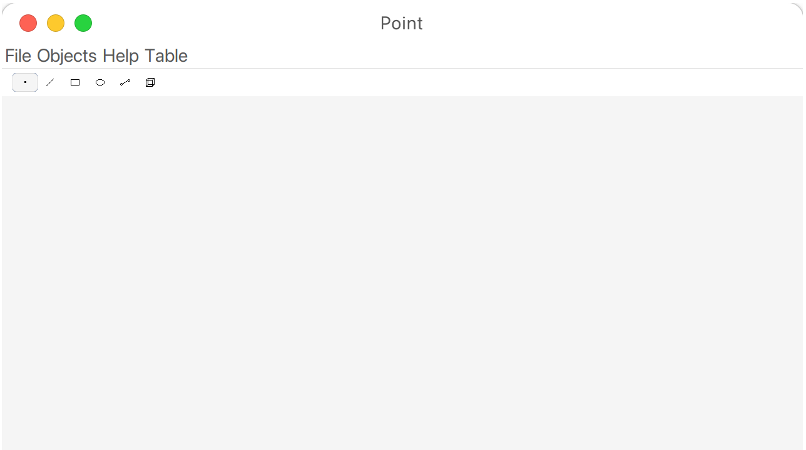

# Drawing App

A simple and lightweight drawing application build with Java Swing. I made this project during the Object Oriented Programming course in my university.

## UI


## Requirments:

- Java 21
- Maven

## Installation

1. Clone the repository:
```
git clone https://github.com/furaizi/drawing-app.git
cd drawing-app
```

2. Run the application:
```
mvn exec:java
```